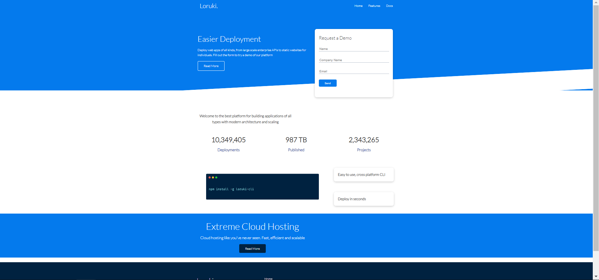

# How to Plan

- Loruki is a small cloud hosting provider that offers a variety of hosting
  > services, including web hosting, cloud storage, and database management.we
  > sit together and discuss about the project and distribute the work to do.
## General

- we did brain storming with discussion about project and planning of action.

> The user of the project is TCS as it is a service provide company.

## Technologies

    Node 14.16.0
    VSC code
    NMP
    Git
    HTML
    CSS

## Setup

- create a new repo form the template `template-html-css`
- add collaborators turn on github pages and give them `write` access
- protect `main` branch
- npm run start

## Code Examples

// the hello world program console.log("Hello World");

## Features

List of features ready and Todos for future development

## Status

Project is done.

## Inspiration

- Webpage is inspired by the programmer fanatic.

## Group Members Name

- [Komal](https://github.com/komal-89)
- [Jean Paul](https://github.com/iradukundajp)
- [Fernando](https://github.com/FernandoYsita)
- [Milena](https://github.com/Mileenka)

## Links-

- [Repo](https://github.com/BF-FrontEnd-class/agile-development-group2-loruki-rebuild.git)

- [Live](https://bf-frontend-class.github.io/agile-development-group2-loruki-rebuild/)
