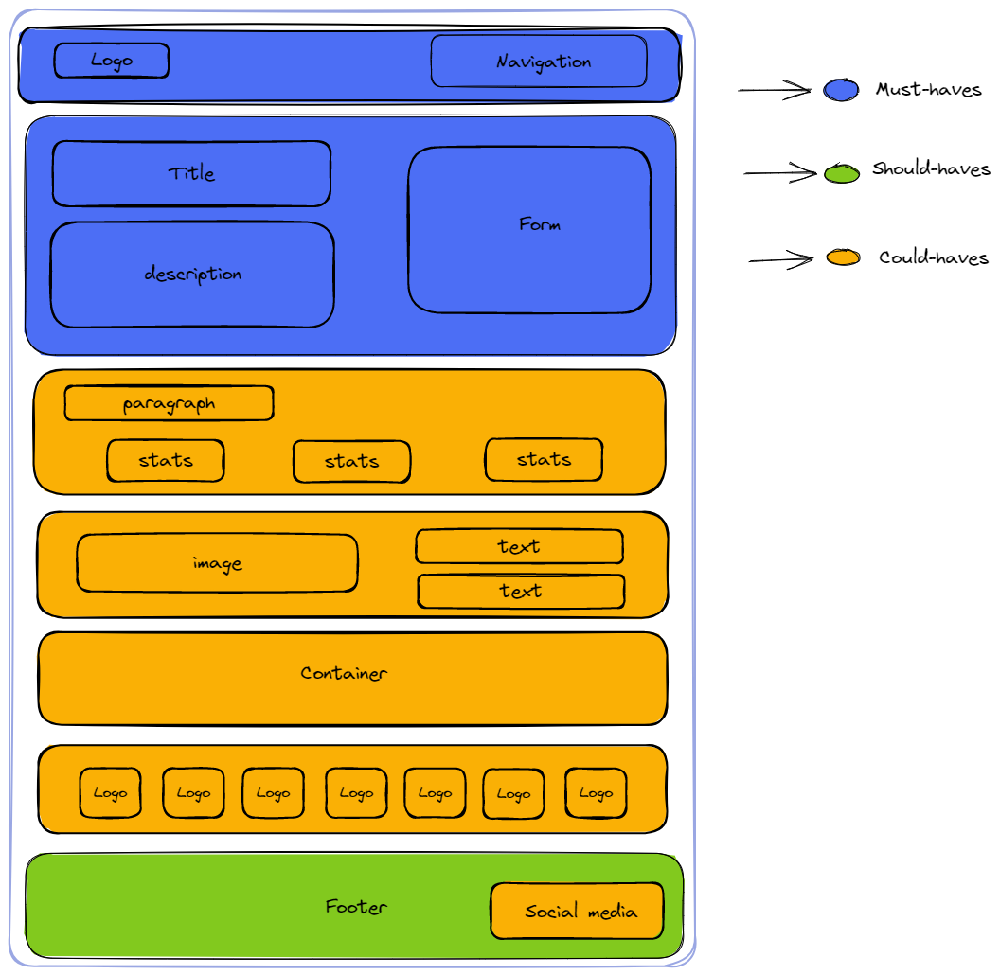
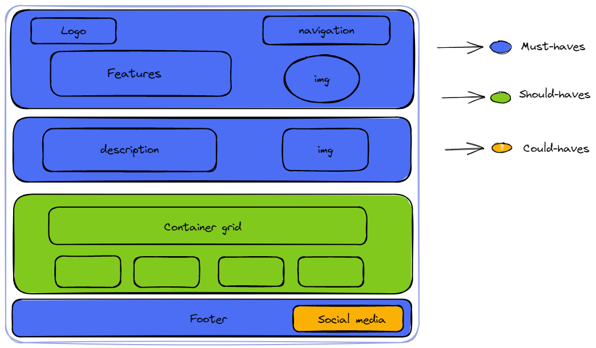
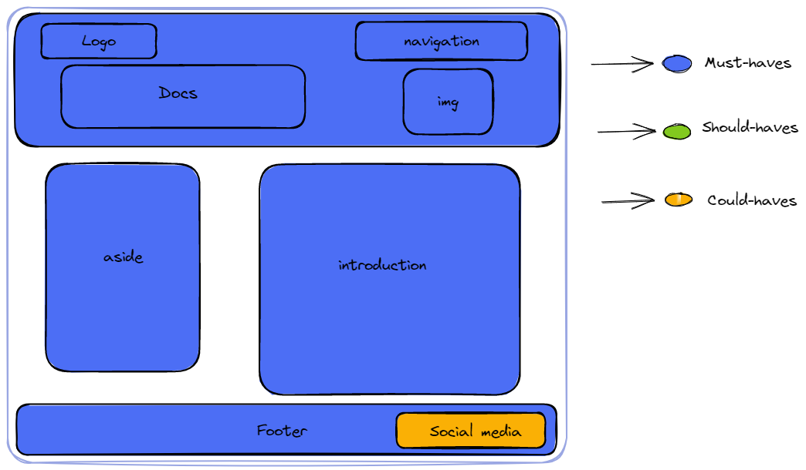

# Design

## Project's design overview

> This is the design of our website.

We are create website which has survey form. We navigate and create a logo for
website. We have create title, description and image. And the end we create a
footer.

We choose that design because it's user usability and it's easy to use.

We choose white and blue as a color because it's a user friendly

---

## Wireframe(s)

### Home Page

> 

### Features page

> 

### Docs page

> 
