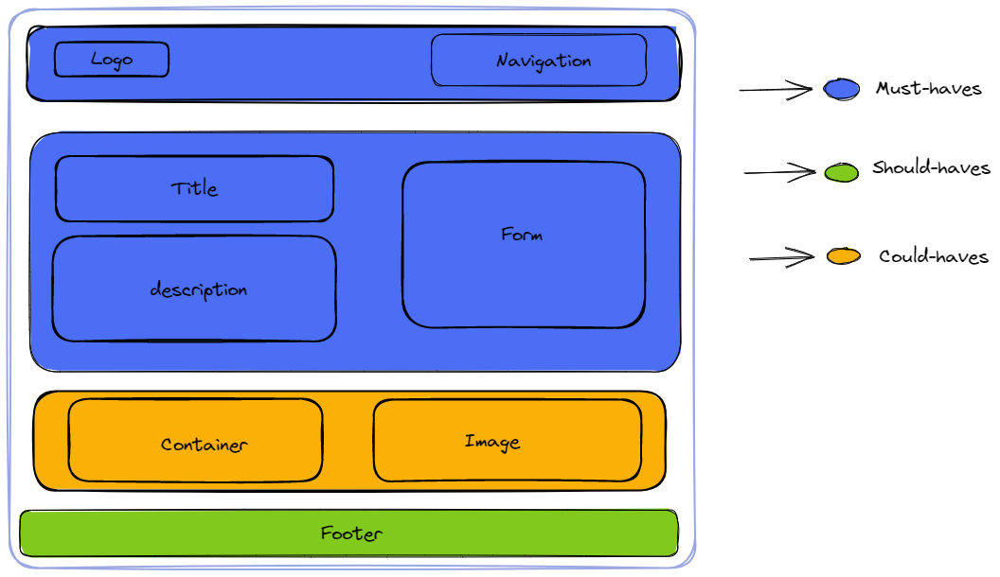
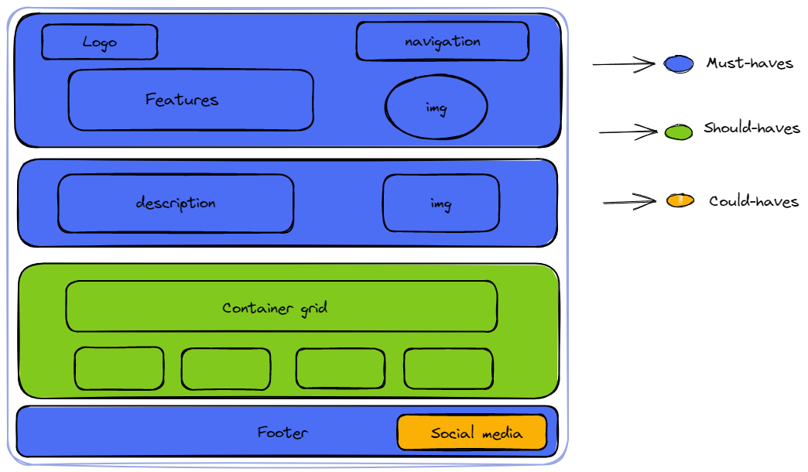

# Loruki

> Loruki is a small cloud hosting provider that offers a variety of hosting
> services, including web hosting, cloud storage, and database management.

## 0.Setup

- create a new repo form the template `template-html-css`
- add collaborators
- turn on github pages and give them `write` access
- protect `main` branch
- turn on discussion

## 1. Homepage Wireframe

## 1.1 Logos

### As a user I want to see the logo in the left-top of the page

- This user story is developed on branch `logo`.
- This branch is merged to `main` branch after completion.

### html

- add `img`

### css

- add class `logo-img` to `img`
- make `display`flex and add `padding`
- add `width` and `height`
- add img

### css

- add class logo

## 1.2 Title

### As a user I want to see the title of the page under the navigation bar

- This user story is developed on branch `title`.
- This branch is merged to `main` branch after completion.

### html

- add `header` tag
- add `h1` for the page title

### css

- add class`centered-item` to the `header`
- make the display `flex` and add `padding`
- style `font`
- add `img`

### css

- add parent
- make the display `flex` and add `padding`

## 1.3 Navigation links

### As a user I want to see navigation links

- This user story is developed on branch `navLinks`.
- This branch is merged to `main` branch after completion.

### html

- add `nav`
- add a `div` parent
- add `a`

### css

- add class `bottom-divider` to `nav`
- add `border`
- add class `spaced-items` to the parent `div`
- make display `flex` and add `padding`
- add img

### css

class parent

- class parent

## 1.4 Description

### As a user I want to see description of the page

- This user story is developed on branch `description`.
- This branch is merged to `main` branch after completion.

### html

- add `section`
- add `p`

### css

- add id `summary-info` to both `section`
- add `main` elem

### css

- add class parent

## 1.5 Form

### As a user I want to see extra link one the page

- This user story is developed on branch `form`.
- This branch is merged to `main` branch after completion.

### html

- add `form`

### css

- add id `form`
- add img

### css

- add- parent

## 1.6 Container

### As a user I want to see container 

- This user story is developed on branch `container`.
- This branch is merged to `main` branch after completion.

### html

- add img

### css

- class parent

## 1.7 Image

### As a user I want to see the logo in the left-top of the page

- This user story is developed on branch `image`.
- This branch is merged to `main` branch after completion.

### html

- add img

### css

- add parent

## 1.8 Footer

### As a user I want to see the footer at the bottom of the page

- This user story is developed on branch `footer`.
- This branch is merged to `main` branch after completion.

### html

- add img

### css

- class parent

## 2. Features

## 2.1 Logos

### As a user I want to see the logo in the left-top of the page

- This user story is developed on branch `logo2`.
- This user story is developed on branch `logo`.
- This branch is merged to `main` branch after completion.

### html

- add `img`

### css

- add class `logo-img` to `img`
- make `display`flex and add `padding`

## 2.2 Navigation links

### As a user I want to see navigation links on the top right side

- This user story is developed on branch `navLinks2`.
- add img

### css

- add class parent

## 2.2 Title

### As a user I want to see the title of the page under the navigation bar

- This user story is developed on branch `title`.
- This branch is merged to `main` branch after completion.

### html

- add `nav`
- add a `div` parent
- add `a`

### css

- add class `bottom-divider` to `nav`
- add `border`
- add class `spaced-items` to the parent `div`
- make display `flex` and add `padding`

## 2.3 Description

### As a user I want to see description of the page

- This user story is developed on branch `description2`.
- This branch is merged to `main` branch after completion.

## html

- add `section`
- add `p`

### css

- add id `summary-info` to both `section`

## 2.3 Features

### As a user I want to see features on the right side of the page

- This user story is developed on branch `features`.
- add img

### css

- add class parent
- make the display `flex` and add `padding`

## 2.3 Navigation links

### As a user I want to see navigation links

- This user story is developed on branch `navLinks`.
- This branch is merged to `main` branch after completion.

### html

- add ing

### css

- add class parent

## 2.4 Description

### As a user I want to see description of the page

- This user story is developed on branch `description`.
- This branch is merged to `main` branch after completion.

### html

- add `section`
- add `p`

### css

- add id `summary-info` to both `section`

## 2.4 Image

### As a user I want to see the two images on the left side of the page

- This user story is developed on branch `image2`.
- add img

### css

- add class parent

## 2.5 Image

### As a user I want to see the logo in the left-top of the page

- This user story is developed on branch `image`.
- This branch is merged to `main` branch after completion.

### html

- add `img`

### css

- add and class `tree-img` to both `img`
- add `display`
- add `width`, `padding`, `margin`, `box-shadow`, `border-radius`

## 2.5 Footer

### As a user I want to see the footer at the bottom of the page

- This user story is developed on branch `footer1`.
- add img

### css

- add class parent

## 2.6 Footer

### As a user I want to see the footer at the bottom of the page

- This user story is developed on branch `footer`.
- This branch is merged to `main` branch after completion.

### html

- add `footer`
- add `p`
- add `a`

### css

- add class `top-divider` and `spaced-items` to `footer`
- add display, position
- add img

### css

- add class parent

## 3. Docs wireframe

## 3.1 Logos

### As a user I want to see the logo in the left-top of the page

- This user story is developed on branch `logo3`
- This user story is developed on branch `logo`.
- This branch is merged to `main` branch after completion.

### html

- add img

### css

- add class parent

## 3.2 Title

### As a user I want to see the title of the page under the navigation bar

- This user story is developed on branch `title`.
- This branch is merged to `main` branch after completion.

### html

- add `img`

### css

- add class `logo-img` to `img`
- make `display`flex and add `padding`
- add `width` and `height`

## 3.2 Navigation links

### As a user I want to see navigation links

- This user story is developed on branch `navLinks3`.
- add img

### css

- add class parent

## 3.3 Navigation links

### As a user I want to see navigation links

- This user story is developed on branch `navLinks`.
- This branch is merged to `main` branch after completion.

### html

- add `nav`
- add a `div` parent
- add `a`

### css

- add class `bottom-divider` to `nav`
- add `border`
- add class `spaced-items` to the parent `div`
- make display `flex` and add `padding`

## 3.3 Aside

### As a user I want to see extra link one the page

- This user story is developed on branch `aside3`.
- add img

### css

- add class parent

## 3.4 Aside

### As a user I want to see extra link one the page

- This user story is developed on branch `aside`.
- This branch is merged to `main` branch after completion.

### html

- add `aside`

### css

- add class `aside`

## 3.4 Introduction

### As a user I want to see introduction in the middle left side of the page

- This user story is developed on branch `introduction3`.
- add img

### css

- add class parent

## 3.5 Introduction

### As a user I want to see introduction --------

- This user story is developed on branch `introduction`.
- This branch is merged to `main` branch after completion.

### html

- add `a`

### css

- add class `intro`

## 3.5 Image

### As a user I want to see image in the left of the page

- This user story is developed on branch `image3`.
- add img

### css

- add class parent

## 3.6 Image

### As a user I want to see the logo in the left-top of the page

- This user story is developed on branch `image`.
- This branch is merged to `main` branch after completion.

### html

- add `img`

### css

- add and class `img2` to both `img`
- add `display`

## 3.6 Documents

### As a user I want to see document on the page

- This user story is developed on branch `documents3`.
- add img

### css

- add class parent

## 3.7 Footer

### As a user I want to see the footer at the bottom of the page

- This user story is developed on branch `footer`.
- This branch is merged to `main` branch after completion.

### html

- add `doc`

### css

- add class `doc`

## 3.7 Footer

### As a user I want to see the footer at the bottom of the page

- This user story is developed on branch `footer3`.
- add img

### css

- add class parent

## 3.8 Documents

### As a user I want to see the footer at the bottom of the page

- This user story is developed on branch `documents`.
- This branch is merged to `main` branch after completion.

### html

- add `footer`
- add `p`
- add `a`

### css

- add class `footer`
- add img

### css

- add class parent
